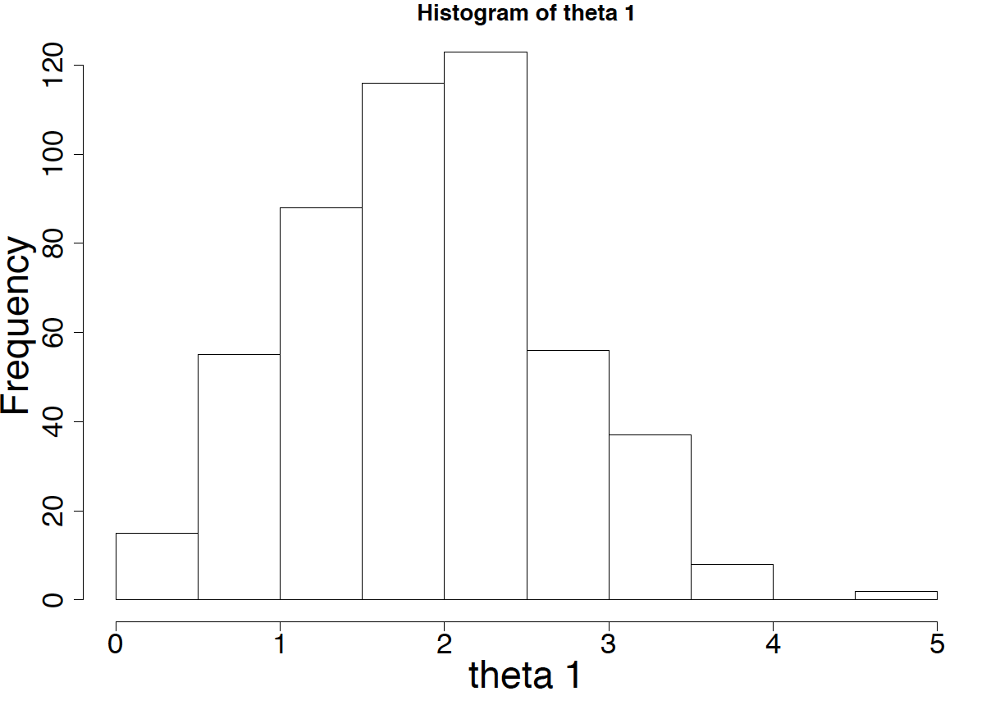
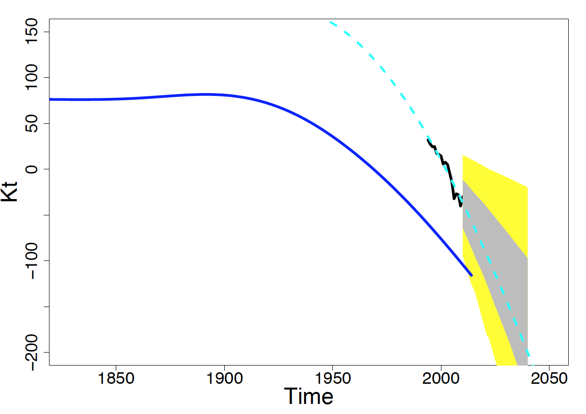

[](http://quantlet.de/)

## [](http://quantlet.de/) **MuPoMo_bootstrap** [](http://quantlet.de/)

```yaml

Name of QuantLet : MuPoMo_bootstrap

Published in : MuPoMo

Description : 'Forecasts mortality rates based on a semi-parametric approach, and bootstraps time
series with innovation to compute the prediction intervals. Uses random two countries to
demonstrate.'

Keywords : 'time series, demography, mortality, population, nonparametric smoothing, parametric
modelling, Lee-Carter method, bootstrap'

See also : 'MuPoMo_data, MuPoMo_optimization, MuPoMo_normalization, MuPoMo_referencecurve,
MuPoMo_main_twopop, MuPoMo_main_multipop'

Author : Lei Fang

Submitted : Mon, June 13 2016 by Lei Fang

Example : Prediction intervals at different levels, Histogram of theta1

```






### R Code:
```r
# clear history and close windows
rm(list=ls(all=TRUE))
graphics.off()

# please set working directory
# setwd("C:/...")     # windows
# setwd("/Users/...") # mac os
# setwd("~/...")      # linux

# install packages
library(demography)
library(rgl)
library(sm)
library(boot)
library(tseries)

# setting
par(mar = c(5, 5, 2, 2), cex.axis = 1.5, cex.lab = 2)
options(digits = 4)

# load saved RData to reduce code-running time from previous procedure (MuPoMo_main_multipop.R)
# load("~/.../MuPoMo_main_multipop.RData")

# Bootstrap to resample from China's mortality time series to construct the CI for shape deviation parameters theta

# Reference time series curve (unchanged). We use for comparing with resampled Japan's mortality TS
kt.referencet = reference4
# Original Japan's mortality TS, from which we are going to take TS bootstrap
boot.data     = kt.Japan.female
# Initialize theta values for optimazation
theta         = theta4[16, ]

### loss function
loss = function(theta, t, kt, t.reference, kt.reference) {
    ## assume theta[1]>0, theta[3]>0, if not, take absolute values
    theta1 = abs(theta[1])
    theta2 = theta[2]
    theta3 = abs(theta[3])
    
    if (theta[1] < 0 | theta[3] < 0) 
        warning("theta1 or theta3 <0, abs value is used")
    # time adjustment
    sm.t = (t.reference - theta2)/theta3  
    ## common domain for kt and time-adjusted kt.reference
    tmin = max(min(t), min(sm.t))
    tmax = min(max(t), max(sm.t))
    # index for common domain
    i0 = which(t >= tmin & t <= tmax)
    
    if (length(i0) > 0) {
        t0 = t[i0]
        ## smooth interpolation of shifted kt.reference on common grid
        dref = data.frame(sm.t = sm.t, kt.reference = kt.reference)
        
        # sm: sm.regression with optimal smoothing parameter 
        h.optimal3 = h.select(sm.t, kt.reference) 
        sm = sm.regression(sm.t, kt.reference, h = h.optimal3, eval.points = t0, model = 'none', poly.index = 1, display = 'none') 
        mu = theta1 * sm$estimate

        ## mean squared error at common grid points
        mse = mean((kt[i0] - mu)^2)  # mse of kt and the modelled one
    } else {
        mse = 1e+09
    }
    return(mse)
}

# Construct the 'statistic' function which is needed and very important in 'tsboot' tsboot (tseries, statistic, R, l = NULL, sim =
# 'model',...)
boot.func = function(kt) {
    t = time(kt)
    t.reference = time(kt.reference)
    ### parameter estimation
    conv   = 1
    theta0 = theta
    while (conv != 0) {
        # check convergence
        out    = optim(theta0, loss, gr = NULL, t, kt, t.reference, kt.reference, control = list(maxit = 1000))  # optimization
        conv   = out$convergence
        theta0 = out$par
    }
    # add constraint on theta2
    if (out$par[2] >= -200 & out$par[2] <= 200) 
        temp.par = out$par else temp.par = theta
    result = c(temp.par, out$value, out$convergence)
}

# simulate time series with innovation
bootdata.fit = auto.arima(boot.data)
sim = 500
plot(boot.data, xlab = "Time", ylab = "Kt", ylim = c(-150, 70), col = "blue", lwd = 10)

for (i in 1:sim) {
    nam5  = paste("sim.ts", i, sep = ".")
    # simulate time seriese based on bootstrap of innovation/error term in ARIMA fitting model
    temp5 = simulate(bootdata.fit, nsim = length(boot.data), future = FALSE, bootstrap = TRUE)
    assign(nam5, temp5)
    # time series test on plot
    lines(temp5, col = "grey")
}

# compute parameters theta's based on bootstrapped time series
theta.boot = matrix(rep(c(0, 0, 0, 0, 0), sim), sim, 5, byrow = TRUE)

for (i in 1:sim) {
    theta.boot[i, ] = boot.func(eval(parse(text = paste("sim.ts", i, sep = "."))))
}

# plot test
hist(theta.boot[, 1], xlab = "theta 1", main = "Histogram of theta 1")
quantile(theta.boot[, 1])

hist(theta.boot[, 2][which(theta.boot[, 2] >= -100 & theta.boot[, 2] <= 100)], xlab = "theta 2", 
     main = "Histogram of theta 2", xlim = c(-5, 5), breaks = 10)
quantile(theta.boot[, 2])

hist(theta.boot[, 3][which(theta.boot[, 3] >= 0.8 & theta.boot[, 3] <= 1.2)], xlab = "theta 3", 
     main = "Histogram of theta 3", xlim = c(0.93, 0.99), breaks = 10)
quantile(theta.boot[, 3])

# forecast with estimated parameters from bootstrap
boot.forecast = function(theta, kt, kt.reference) {
    t = time(kt)
    t.reference = time(kt.reference)
    ### check results on graph
    theta1 = abs(theta[1])
    theta2 = theta[2]
    theta3 = abs(theta[3])
    # time adjustment
    sm.t = (t.reference - theta2)/theta3
    ## common grid for kt and shifted kt.reference
    tmin = max(min(t), min(sm.t))
    tmax = min(max(t), max(sm.t))
    i0   = which(t >= tmin & t <= tmax)
    t0   = t[i0]
    ## shifted curves (kt.hat)
    dref = data.frame(sm.t = sm.t, kt.reference = kt.reference)
    # sm: sm.regression with optimal smoothing parameter
    h.optimal4 = h.select(sm.t, kt.reference)
    sm = sm.regression(sm.t, kt.reference, h = h.optimal4, eval.points = sm.t, model = "none", poly.index = 1, display = "none")
    mu = theta1 * sm$estimate

    mu = ts(mu, start = sm.t[1], frequency = theta3)
    
    # sm: sm.regression with optimal smoothing parameter
    h.optimal5 = h.select(sm.t, kt.reference)
    sm0 = sm.regression(sm.t, kt.reference, h = h.optimal5, eval.points = t0, model = "none", poly.index = 1, display = "none")
    mu0 = theta1 * sm0$estimate

    mu0 = ts(mu0, start = t0[1], frequency = 1)
    
    return(list(mu, mu0, tmin, tmax))
}

# forecast
plot(forecast(bootdata.fit, h = 40, level = 95), xlab = "Time", ylab = "Kt", xlim = c(1828, 2050), ylim = c(-200, 150))
lines(kt.referencet, col = "blue", lwd = 5)
lines(boot.data, col = "red", lwd = 5)

for (i in 1:sim) {
    temp  = boot.forecast(theta.boot[i, 1:3], boot.data, kt.reference)
    nam12 = paste("shift.kt.boot", i, sep = ".")
    assign(nam12, temp[[2]])
    nam15 = paste("mu.boot", i, sep = ".")
    assign(nam15, temp[[1]])
    lines(temp[[2]], col = "green")  
    lines(temp[[1]], col = "grey")  
}

# prediction interval
for (i in 2010:2050) {
    nam = matrix(0, 1, 500)
    for (j in 1:sim) {
        if (max(time(eval(parse(text = paste("mu.boot", j, sep = "."))))) >= i) 
            nam[j] = window(eval(parse(text = paste("mu.boot", j, sep = "."))), i)[1] else nam[j] = NA
    }
    nam1 = paste("ts", i, sep = ".")
    assign(nam1, nam)
    nam2 = paste("ts", i, 5, sep = ".")
    assign(nam2, quantile(nam, probs = seq(0, 1, 0.05), na.rm = T)[2])
    nam3 = paste("ts", i, 95, sep = ".")
    assign(nam3, quantile(nam, probs = seq(0, 1, 0.05), na.rm = T)[20])
    nam4 = paste("ts", i, 20, sep = ".")
    assign(nam4, quantile(nam, probs = seq(0, 1, 0.05), na.rm = T)[5])
    nam5 = paste("ts", i, 80, sep = ".")
    assign(nam5, quantile(nam, probs = seq(0, 1, 0.05), na.rm = T)[17])
}

for (j in c(5, 20, 80, 95)) {
    ts.temp = ts(0, start = 2010, end = 2040, frequency = 1)
    for (i in 2010:2040) {
        ts.temp[i - 2009] = eval(parse(text = paste("ts", i, j, sep = ".")))
    }
    nam6 = paste("ts.forecast", j, sep = ".")
    assign(nam6, ts.temp)
}

# plot
plot(boot.data, lwd = 5, xlab = "Time", ylab = "Kt", xlim = c(1828, 2050), ylim = c(-200, 150))
polygon(c(2010:2040, rev(2010:2040)), c(ts.forecast.5, rev(ts.forecast.95)), col = "yellow", border = FALSE)
polygon(c(2010:2040, rev(2010:2040)), c(ts.forecast.20, rev(ts.forecast.80)), col = "Gray", border = FALSE)
lines(kt.referencet, col = "blue", lwd = 5)
lines(mu.China.4, col = 5, lty = 2, lwd = 4)
```
