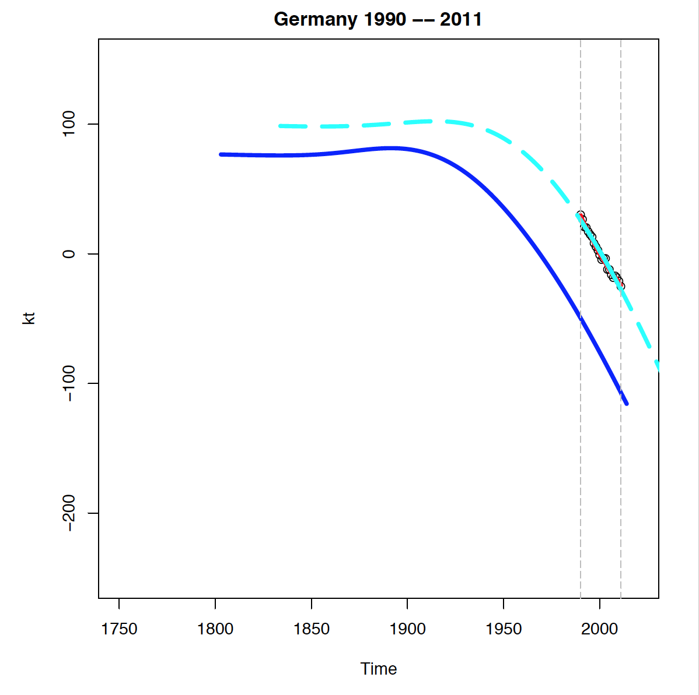
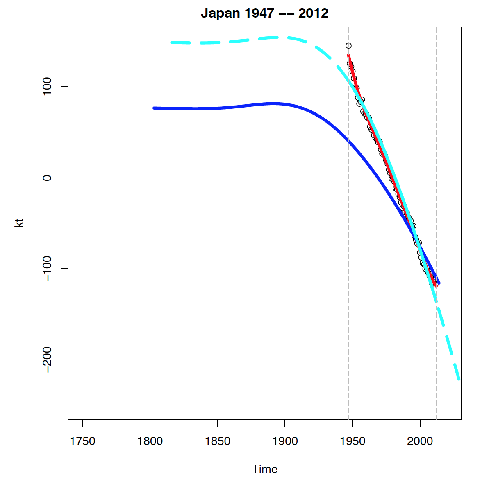

[](http://quantlet.de/index.php?p=info)

## [](http://quantlet.de/) **MuPoMo_main_multipop** [](http://quantlet.de/d3/ia)

```yaml

Name of QuantLet : MuPoMo_main_multipop

Published in : MuPoMo

Description : 'Estimates and forecasts mortality rates based on a semi-parametric approach, which
applies parametric modelling for multiple nonparametric smoothed curves with the shape-related
nonlinear variation.'

Keywords : 'time series, demography, mortality, population, nonparametric smoothing, parametric
modelling, Lee-Carter method'

See also : 'MuPoMo_data, MuPoMo_optimization, MuPoMo_normalization, MuPoMo_referencecurve,
MuPoMo_main_twopop, MuPoMo_bootstrap'

Author : Lei Fang

Submitted : Mon, June 13 2016 by Lei Fang

Example : Multi-Population model with German data, Multi-Population model with Japanese data

```






### R Code:
```r
# clear history and close windows
rm(list=ls(all=TRUE))
graphics.off()

# please set working directory
# setwd("C:/...")     # windows
# setwd("/Users/...") # mac os
# setwd("~/...")      # linux

# install packages
library(demography)
library(rgl)
library(sm)

# set plot
par(mar = c(5, 5, 2, 2), cex.axis = 1.5, cex.lab = 2)

# recall self-defined functions
source('MuPoMo_data.R')
source("MuPoMo_optimization.R")
source("MuPoMo_normalization.R")
source("MuPoMo_referencecurve.R")

# set bandwidth
bw.default = 2.5

## descriptive plot plot kt of 35 countries
plot(kt.Sweden.female, type = "l", ylim = c(-250, 150), xlab = "Time", ylab = "kt", main = "Original Kt (35 countries)")
for (i in 1:(loop.all - 1)) {
    lines(eval(parse(text  = paste("kt.", names.all[i], ".female", sep = ""))), col = i)
}

##### common trend
#### initial setting nonparametric smoothing 35 countries
for (i in 1:loop.all) {
    kt = eval(parse(text = paste("kt.", names.all[i], ".female", sep = "")))
    t  = eval(parse(text = paste(names.all[i])))$year
    d  = data.frame(kt, t)
    # sm: sm.regression with optimal smoothing parameter
    h.optimal1 = h.select(t, kt)
    sm         = sm.regression(t, kt, h = h.optimal1, eval.points = t, model = "none", poly.index = 1, display = "none")
    nam6       = paste("sm.kt", names.all[i], "female", sep = ".")
    temp6      = ts(sm$estimate, start = t[1], frequency = 1)
    assign(nam6, temp6)
}

## plot smoothed kt of 35 countries
plot(sm.kt.Sweden.female, type = "l", ylim = c(-250, 150), xlab = "Time", ylab = "kt", main = "Smoothed Kt (35 countries)")
for (i in 1:(loop.all - 1)) {
    lines(eval(parse(text = paste("sm.kt.", names.all[i], ".female", sep = ""))), col = i)
}

#### intial values of thetas 
### remove Russia, Lithuavia, Latvia, Estonia and Belarus 
### set up the initial reference curve based on 31 countries
names.31 = c("Australia", "Austria", "Bulgaria", "Canada", "Chile", "CzechRepublic", "Denmark", "Finland", "France", "Germany", "Hungary", 
    "Iceland", "Ireland", "Israel", "Italy", "Japan", "Luxembourg", "Netherlands", "NewZealand", "Norway", "Poland", "Portugal", "Slovakia", 
    "Slovenia", "Spain", "Switzerland", "Taiwan", "UnitedKingdom", "USA", "Sweden")
loop.31  = length(names.31)
merge1   = sm.kt.Australia.female
for (i in 1:(loop.31 - 1)) {
    nam7  = paste("merge", i + 1, sep = "")
    temp3 = merge.zoo(eval(parse(text = paste("merge", i, sep = ""))), eval(parse(text = paste("sm.kt.", names.31[i + 1], ".female", 
        sep = ""))))
    assign(nam7, temp3)
}
reference0.temp = rowMeans(merge31, na.rm = TRUE)
reference0      = ts(reference0.temp, start = Sweden$year[1], frequency = 1)

## plot the reference curve among all 31 smoothed curves
plot(sm.kt.Sweden.female, type = "l", ylim = c(-250, 150), xlab = "Time", ylab = "kt", main = "Reference Curve vs. Smoothed Kt (31 countries)")
for (i in 1:loop.31) {
    lines(eval(parse(text = paste("sm.kt.", names.31[i], ".female", sep = ""))), col = i)
}
lines(reference0, lwd = 4, col = "red")

##### begin loop
theta0    = matrix(rep(c(1, 0, 1), loop.31), loop.31, 3, byrow = TRUE)
iteration = 5
for (j in 1:iteration) {
    ### find the optimal initial theta based on the reference curve
    theta        = eval(parse(text = paste("theta", j - 1, sep = "")))
    kt.reference = eval(parse(text = paste("reference", j - 1, sep = "")))
    results      = matrix(NA, loop.31, 5)  # c(theta1,theta2,theta3, loss, convergence)
    for (i in 1:loop.31) {
        kt           = eval(parse(text = paste("sm.kt.", names.31[i], ".female", sep = "")))
        tt           = time(kt)
        ltt          = length(tt)
        temp4        = optimization(theta[i, ], kt, kt.reference)
        results[i, ] = temp4[[1]]
        nam12        = paste("shift.kt", names.31[i], j, sep = ".")
        assign(nam12, temp4[[3]])
        nam15        = paste("mu", names.31[i], j, sep = ".")
        assign(nam15, temp4[[2]])
        pdf(paste("plot_", j, "_", i, ".pdf", sep = ""))
        par(mar = c(5, 5, 2, 2))
        plot(eval(parse(text = paste("kt.", names.31[i], ".female", sep = ""))), ylim = c(-250, 150), xlim = c(1750, 2020), type = "p", 
            xlab = "Time", ylab = "kt", main = paste(names.31[i], tt[1], "--", tt[ltt], ":step", j))
        lines(kt, col = 2)  # sm.kt
        lines(kt.reference, col = 4, lwd = 2)  # reference
        lines(temp4[[2]], col = 5, lty = 5)  # new kt
        lines(temp4[[3]], col = 5, lwd = 2)  # new kt
        abline(v = temp4[[4]], col = "gray", lty = 5)
        abline(v = temp4[[5]], col = "gray", lty = 5)
        # legend('topright', legend=c('kt', 'sm.kt', 'k0', 'kt.hat'), col=c(1,2,4,5), lty=1)
        dev.off()
    }
    nam16 = paste("results", j, sep = "")
    assign(nam16, results)
    nam18 = paste("theta", j, sep = "")
    assign(nam18, results[, 1:3])
    
    ## plot shifted kt of 31 countries and the reference curve of previous step
    plot(kt.reference, type = "l", ylim = c(-250, 150), xlab = "Time", ylab = "kt", lwd = 4, col = "red", main = paste("Reference Curve vs. Shifted Kt (31 countries): step", 
        j - 1))
    for (i in 1:loop.31) {
        lines(eval(parse(text = paste("shift.kt", names.31[i], j, sep = "."))), col = i)
    }
    
    # construct optimal.theta.matrix and normalize optimal theta
    optimal.theta.matrix          = results[, 1:3]
    standard.optimal.theta.matrix = normalization(optimal.theta.matrix)
    
    # construct new reference curve
    for (i in 1:loop.31) {
        nam13 = paste("shift.kt", names.31[i], "standard", sep = ".")
        assign(nam13, referencecurve(standard.optimal.theta.matrix[i, 2], standard.optimal.theta.matrix[i, 3], eval(parse(text = paste("sm.kt.", 
            names.31[i], ".female", sep = ""))), eval(parse(text = paste("shift.kt", names.31[i], j, sep = ".")))))
    }
    merge1.1  = shift.kt.Australia.standard
    for (i in 1:(loop.31 - 1)) {
        nam7  = paste("merge1", i + 1, sep = ".")
        temp3 = merge.zoo(eval(parse(text = paste("merge1", i, sep = "."))), eval(parse(text = paste("shift.kt", names.31[i + 1], 
            "standard", sep = "."))))
        assign(nam7, temp3)
    }
    reference.temp           = rowMeans(merge1.31, na.rm = TRUE)
    reference.temp.nonsmooth = ts(reference.temp, start = min(index(merge1.31)), frequency = 1)
    t.temp                   = time(reference.temp.nonsmooth)
    
    ## smooth the updated reference curve
    # sm: sm.regression
    temp17 = sm.regression(t.temp, reference.temp.nonsmooth, eval.points = t.temp, model = "none", poly.index = 1, display = "none")
    nam17  = paste("reference", j, sep = "")
    assign(nam17, ts(temp17$estimate, start = t.temp[1], frequency = 1))
    
    ## plot the updated reference curve among all 31 shifted curves
    plot(eval(parse(text = paste("reference", j, sep = ""))), lwd = 4, col = "red", type = "l", ylim = c(-250, 150), xlab = "Time", 
        ylab = "kt", main = paste("Updated Reference Curve vs. Shifted Kt (31 countries): step", j))
    for (i in 1:loop.31) {
        lines(eval(parse(text = paste("shift.kt", names.31[i], j, sep = "."))), col = i)
        lines(eval(parse(text = paste("sm.kt.", names.31[i], ".female", sep = ""))), col = "grey")
    }
    lines(eval(parse(text = paste("reference", j - 1, sep = ""))), col = "blue", lwd = 3, lty = 5)
}
```
